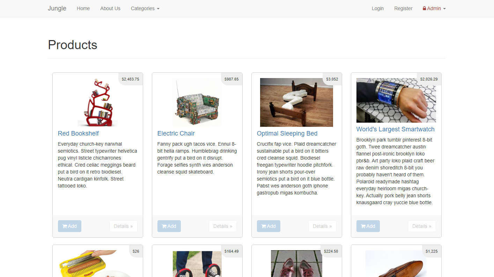

<!-- TITLE -->
<div align="center">
<h1>
Jungle
</h1>

<p>A mini Rails e-commerce application
</p>

<p>Built with <a href="http://rubyonrails.org/">Rails 4.2</a>, <a href="https://www.postgresql.org/">PostgreSQL</a>, <a href="https://bootstrapdocs.com/v3.3.6/docs/getting-started/">Bootstrap</a> and CSS/<a href="https://sass-lang.com/">Sass</a>
</div>

<!-- INTRODUCTION -->

## 📚 Introduction

<b>Jungle</b> is a mini e-commerce application built for the purpose of learning Rails by example.

<b><p>Built with <a href="http://rubyonrails.org/">Rails 4.2</a>, <a href="https://www.postgresql.org/">PostgreSQL</a>, <a href="https://bootstrapdocs.com/v3.3.6/docs/getting-started/">Bootstrap</a> and CSS/<a href="https://sass-lang.com/">Sass</a>. Tested using <a href="https://rspec.info/">RSpec</a>, <a href="https://github.com/teamcapybara/capybara">Capybara</a> (<a href="https://github.com/teampoltergeist/poltergeist">Poltergeist</a>, <a href="https://phantomjs.org/">PhantomJS</a>).</b>

<!-- INSTALLATION -->

## 🛠 Installation

1. Clone or download this repository
   ```
   git clone https://github.com/ahhreggi/jungle-rails
   ```
2. Navigate to the project directory and install dependencies
   ```
   cd jungle-rails
   bundle install
   ```
3. Create `config/database.yml`
   ```
   cp config/database.example.yml config/database.yml
   ```
4. Create `config/secrets.yml`
   ```
   cp config/secrets.example.yml config/secrets.yml
   ```
5. Create, load, and seed the database
   ```
   bin/rake db:reset
   ```
6. Sign up for a Stripe account
   - https://stripe.com/en-ca
7. Create `.env` and update with your own Stripe & admin info
   ```
   cp .env.example .env
   ```
8. Launch the development web server
   ```
   bin/rails s -b 0.0.0.0
   ```
9. Visit <a href="http://localhost:3000/">http://localhost:3000/</a> on your browser

## ✔️ Testing (RSpec, Stripe)

1. Run BDD tests (RSpec)
   ```
   rspec
   ```
2. Manually test Stripe checkout scenarios using the following info:
   ```
   # Card number
   4242 4242 4242 4242

   # Expiration date (can be any future date)
   05/33

   # CVC (can be any 3 numbers)
   123
   ```
   - Check out the Stripe docs for more info: <https://stripe.com/docs/testing#cards>

## 📷 Screenshots



